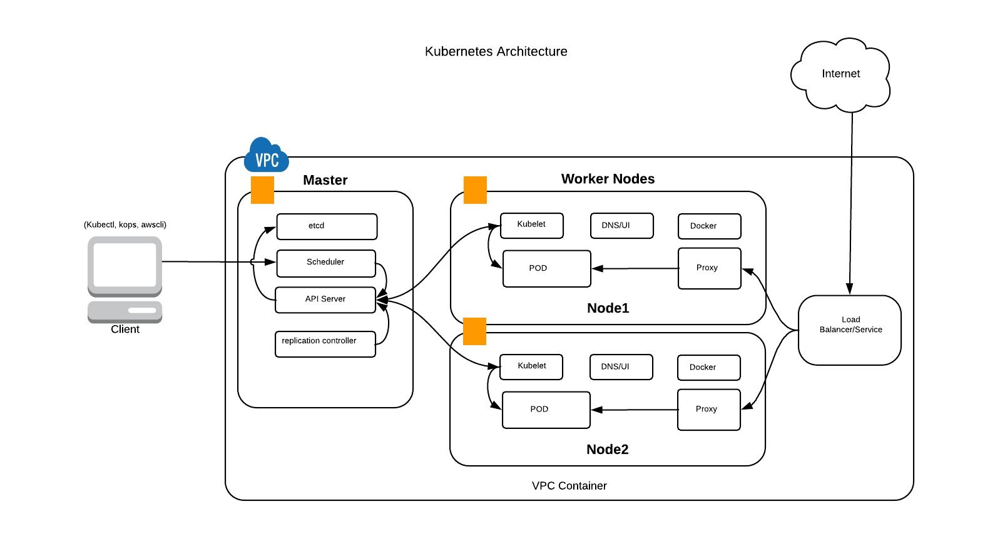

= Kubernetes Java Workshop
:toc:
:toclevels: 3
:toc-placement!:

toc::[]

This project shows different recipes to run a Java EE application using Kubernetes.

== Chapter 1 : Kubernetes Concepts and Architecture

Kubernetes is a portable, extensible open-source platform for managing containerized workloads and services, that facilitates both declarative configuration and automation. It has a large, rapidly growing ecosystem. Kubernetes services, support, and tools are widely available.

Google open-sourced the Kubernetes project in 2014. Kubernetes builds upon a decade and a half of experience that Google has with running production workloads at scale, combined with best-of-breed ideas and practices from the community.

Kubernetes has three main components.

* Client 
* Master
* Worker Nodes

* Client : Client is a local developer machine or any machine from where you execute commands to deploy resources in kubernetes. 

Install below components on client machine to intract with kubernetes

. *kubectl*: Kubectl is a command line interface for running commands against Kubernetes clusters
. *kops*: Kubernetes Operations, or Kops, is an open source project used to set up Kubernetes clusters easily and swiftly
. *awscli or terraform*: The AWS Command Line Interface (CLI) is a unified tool to manage your AWS services. 

* Master : Master components provide the cluster’s control plane. Master components make global decisions about the cluster (for example, scheduling), and detecting and responding to cluster events (starting up a new pod when a replication controller’s ‘replicas’ field is unsatisfied).

. *Pods*: Collocated group of Docker containers that share an IP and storage volume
. *Service*: Single, stable name for a set of pods, also acts as load balancer
. *Replication Controller*: Manages the lifecycle of pods and ensures specified number are running
. *Labels*: Used to organize and select group of objects
. *etcd*: Distributed key-value store used to persist Kubernetes system state
. *Master*: Hosts cluster-level control services, including the API server, scheduler, and controller manager
. *Node*: Docker host running _kubelet_ (node agent) and proxy services
. *Kubelet*: It runs on each node in the cluster and is responsible for node level pod management.

.Kubernetes Architecture

