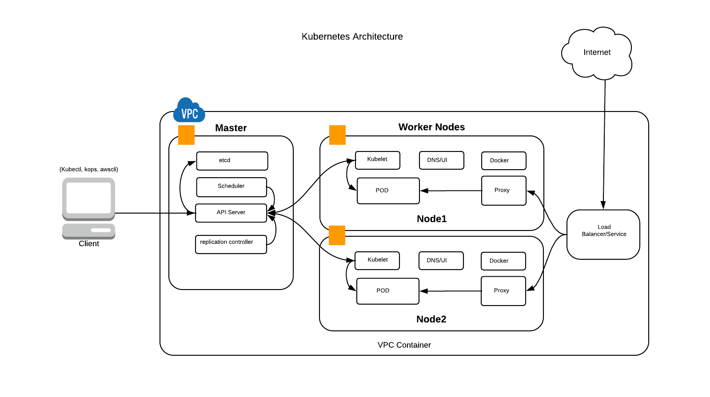

= Kubernetes Java Workshop
:toc:
:toclevels: 3
:toc-placement!:

toc::[]

This project shows different recipes to run a Java EE application using Kubernetes.

== Kubernetes Concepts

Key concepts of Kubernetes are explained below:

. *Pods*: Collocated group of Docker containers that share an IP and storage volume
. *Service*: Single, stable name for a set of pods, also acts as load balancer
. *Replication Controller*: Manages the lifecycle of pods and ensures specified number are running
. *Labels*: Used to organize and select group of objects
. *etcd*: Distributed key-value store used to persist Kubernetes system state
. *Master*: Hosts cluster-level control services, including the API server, scheduler, and controller manager
. *Node*: Docker host running _kubelet_ (node agent) and proxy services
. *Kubelet*: It runs on each node in the cluster and is responsible for node level pod management.

.Kubernetes Architecture

